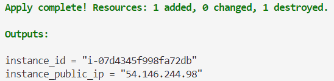
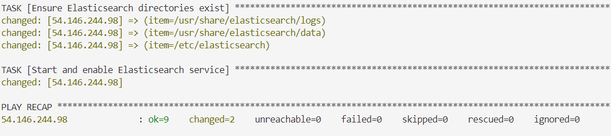
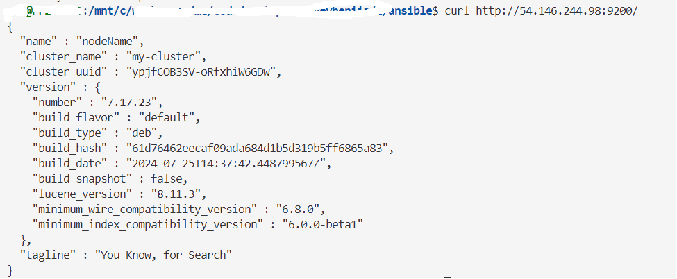

## The documentation below describes how to provision AWS EC2 virtual machine and install Elasticsearch

### Prerequisites
- AWS account
- Configured AWS CLI.
- Installed terraform. Version >= v1.8.x
- Installed ansible. Version >= 2.x.x

### 1. Generate key for SSH connection

```shell 
ssh-keygen -t rsa -b 4096 -f ~/.ssh/my_ssh_key
```

### 2. Provision AWS EC2 using terraform 

Make sure that you in ias folder 

```shell 
cd ias
```

```shell 
terraform init
```

Mandatory param to run terraform is `ssh_public_key_path`

Apply terraform.
```shell 
terraform apply -var "ssh_public_key_path=~/.ssh/my_ssh_key.pub"
```

Also, you can specify:
- `ami_id` - Should be Ubuntu based.
- `instance_type`
- `aws_region` 
- `ssh_key_name`

Default values can be found in `ias/variables.tf` file.

If provisiong finished successfully you will be able to see similar output to this:




### 3.Execute Ansible playbook
Take public ip of VM from previous step.

Make sure that you in `ansible` folder.
```shell 
cd ansible
```

Replace `<tf.output.instance_public_ip>` to public IP of VM instance.

Run playbook to install Elasticsearch.
```shell 
ansible-playbook -i <tf.output.instance_public_ip>, provision_elastic.yml --extra-vars "ansible_user=ubuntu ansible_ssh_private_key_file=~/.ssh/my_ssh_key"
```

In case of success you wil able to see similar output. 


### 4. Verify everything 

Open in your favorite browser or use curl to access Elasticsearch.

```shell
curl http:<tf.output.instance_public_ip>//:9200
```

Result should be:


If you faced problems during execution terraform of ansible feel free to contact 
[support\@blablabla.com](mailto:hientran@clientdiary.com?subject=ElasticSearch)